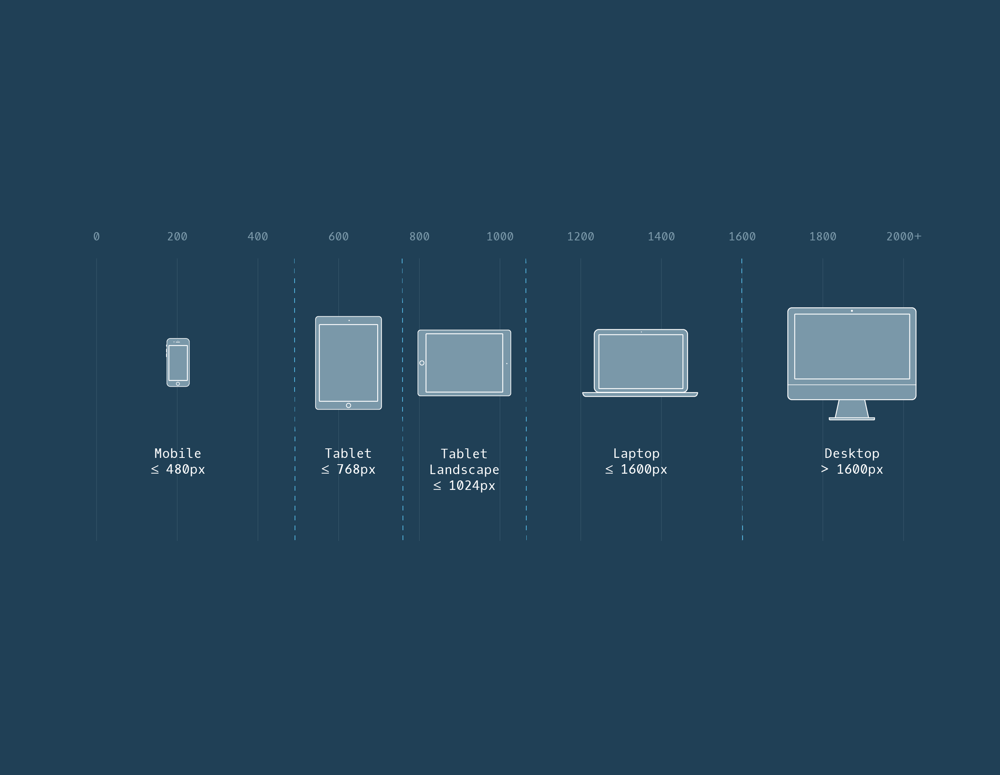

## Typography
- Justification : 65 caractères
- Width : taille de la police\*30
- Interligne : police+ 2 à 5
	- ligne-height :
- blockquote : text-indent : -0,8em
- em = 20px

## CSS

- le bloc bleu est le contenu
- margin :
			- next element
			- top, bottom, left, right
- border :
			- thickness
			- type : solid, dotted, dashed
			- color
- display :
			- block : nouvelle ligne, toute la largeur
			- inline : largeur nécessaire sur la ligne
			- flex : can be used to align multiple page elements horizontaly
			- inline-block
- HTML, heading, paragraph, <ul> : each appaears on its own line
- image & anchor elements : same line
- float : left, right. Flotte au lieu de pousser à la ligne
- flex-wrap ; no child element move (wrap)
- justify-content : center
- position : relative, static, absolute, fixed
	- top, left, right, bottim : \*\*px
- font-size :
	- em : 16px de base
	- rem
- list-style: none;
- Overflow :
 - visible
 - hidden
 - scroll
 - auto
- word-wrap: break-word;
- IMG  : 	- overflow : hidden;
			- background-size: cover;
```css
@media only screen and (max-width:480px){
	body {font-size:12px;}
}
```
- remarque : 	-> and = operator

- @media : how to parse the rest of the rul
- only : screen or handled
- rule : media feature
- range :
	- @media only screen and (min-width:320px and (max-width:480px))
- min-resolution : 300dpi;
- @media only screen and (min-width:480px), (orientation: landscape)
    - /!\\ : virgule
- orientation : landscape or portrait
## Break Points
- body : display : grid
		- grid-template-colums: 30% auto
		- grid-template-rows : 60px auto 60px;
		- grid-template-areas :
								- "hd hd"
								- "sid sid"
								- "fo fo"
- header : grid-area : hd;
- flex-direction : rown, column;
- justify-content : center, flex-start, space-around, space-between;
- align-items : center;
- height : 100%;
- items :
	- margin : 0 10px;
- flex-wrap : wrap;
- flex-flow : row wrap;
- align-items : stretch (défaut), flex-start, flex-end, center;
- align-content : space-between, space-around;


## Boostrap : 12-colum grid
			
- Screen sizes : 

## HTML
- "&copy" = ©
```html
	<video src="*.mp4" width="320" height="240" controls poster="image.jpg">
	video not supported </video>
```
